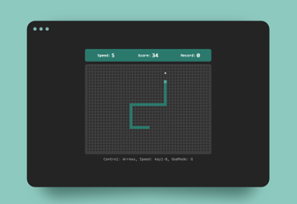

# Snake Game

A classic Snake game implemented using HTML, CSS, and JavaScript.

## Table of Contents

- [About the Project](#about-the-project)
- [Screenshots](#screenshots)
- [Built With](#built-with)
- [Getting Started](#getting-started)
  - [Prerequisites](#prerequisites)
  - [Installation](#installation)
- [Usage](#usage)
- [Features](#features)
- [Contact](#contact)

## About the Project

This project is a simple implementation of the classic Snake game using modern web technologies. The player controls the snake to eat food, which makes the snake grow longer. The game ends when the snake collides with itself or the walls.

## Screenshots
 

 

## Built With

- HTML
- CSS
- JavaScript

## Getting Started

To get a local copy up and running follow these simple steps.

### Prerequisites

You need a modern web browser to run this game.

### Installation

1. Clone the repo : 
   git clone [https://github.com/your_username/snake-game.git](https://github.com/sharath453/Snake_Game.git)
   
Open the index.html file in your browser to start the game.
# Usage
1. Use the arrow keys to control the direction of the snake.
2. Try to eat the food to grow longer.
3. Avoid running into the walls or the snake's own body.
# Features
1. Classic Snake gameplay
2. Simple and clean user interface
3. Real-time score display
4. Responsive design
5. Contributing

# Contact
Email - alsharath66@gmail.com  
linkedin - https://www.linkedin.com/in/sharath-a-l-877754249/

# Project Link: [https://github.com/your_username/snake-game](https://github.com/sharath453/Snake_Game.git)
